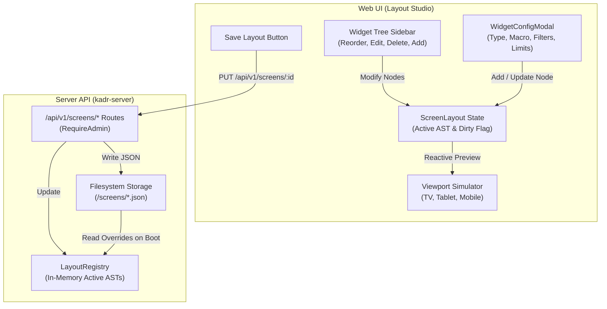

# Interactive Layout Studio & Media Type Expansion Design Specification

## Overview
This specification details the architecture, data models, APIs, and user interface for two key capabilities in Kadr:
1. **Interactive Layout Studio**: Enabling users to interactively create, customize, configure, reorder, delete, and persist screen AST layouts (`Home`, `Movies`, `Shows`, and custom screens) directly from the Web UI.
2. **Library Media Type Expansion**: Expanding the library classification system beyond just Movies and TV Shows to natively support Anime, Music & Concerts, Home Videos, and Audiobooks/Podcasts.

---

## 1. Background & Goals
* **Problem**:
  * The current Layout Studio (`web/src/components/studio/LayoutStudio.tsx`) is a read-only viewport simulator where users can only toggle widget visibility in ephemeral local state. There is no mechanism to create custom widgets, configure query bindings/macros, reorder or delete widgets, or persist changes back to the server.
  * The media library creation modal only permits selecting `Movie` or `Show`, limiting organization for anime collections, music/concerts, home videos, and spoken word media.
* **Goals**:
  * Implement full backend persistence for Screen AST layouts with `PUT /api/v1/screens/{id}`, `POST /api/v1/screens`, and `DELETE /api/v1/screens/{id}`.
  * Persist customized layouts on disk at `<data_dir>/screens/<id>.json` so custom screen setups survive restarts while allowing built-in defaults to be restored.
  * Deliver a complete visual AST builder in Layout Studio with an **Add/Edit Widget Configurator Modal**, widget reordering (↑/↓), deletion, live preview updates, and a "Save Layout" workflow.
  * Expand `MediaType` in `kadr-core` and the Admin library creation modal to support `Anime`, `Music`, `HomeVideos`, and `Audiobook`.

---

## 2. Architecture & Data Flow



---

## 3. Detailed Specifications

### 3.1 Backend Persistence & Screen API (`crates/kadr-server`)

All mutation routes require administrator authorization (`RequireAdmin`).

#### Endpoints
1. **`PUT /api/v1/screens/{id}`**
   * **Purpose**: Persist modified AST layout for screen `{id}`.
   * **Request Body**: `ScreenLayout` JSON:
     ```json
     {
       "id": "home",
       "title": "Home",
       "description": "Customized home dashboard",
       "widgets": [
         {
           "type": "hero_banner",
           "id": "hero_spotlight",
           "binding": {
             "macro_type": "spotlight_item",
             "limit": 1
           }
         },
         {
           "type": "carousel",
           "id": "recent_movies",
           "title": "Recently Added",
           "binding": {
             "macro_type": "recently_added",
             "limit": 20,
             "sort": "date_desc"
           }
         }
       ]
     }
     ```
   * **Behavior**:
     * Validates that `payload.id` matches the `{id}` path parameter.
     * Ensures `<data_dir>/screens` exists (creates parent directories if needed).
     * Serializes layout to `<data_dir>/screens/<id>.json`.
     * Calls `LayoutRegistry::register_screen(payload)` to update the live in-memory registry.
   * **Response**: `200 OK` returning the saved `ScreenLayout`.

2. **`POST /api/v1/screens`**
   * **Purpose**: Create a brand new custom screen.
   * **Request Body**:
     ```json
     {
       "id": "anime",
       "title": "Anime Hub",
       "description": "Custom anime collection and spotlights"
     }
     ```
   * **Behavior**:
     * Validates that `id` contains only alphanumeric characters, dashes, or underscores.
     * Initializes default starter widgets for the new screen (e.g., a default Carousel).
     * Writes to `<data_dir>/screens/<id>.json`.
     * Registers screen in `LayoutRegistry`.
   * **Response**: `201 Created` returning the initialized `ScreenLayout`.

3. **`DELETE /api/v1/screens/{id}`**
   * **Purpose**: Reset built-in screen to factory default or delete custom screen.
   * **Behavior**:
     * Deletes `<data_dir>/screens/<id>.json` if present.
     * If `{id}` is built-in (`home`, `movies`, `shows`): re-instantiates factory default layout and registers it.
     * If `{id}` is custom: removes `{id}` from `LayoutRegistry.order` and `LayoutRegistry.screens`.
   * **Response**: `200 OK` returning `{ "status": "reset", "id": "{id}" }`.

---

### 3.2 Media Type Expansion (`crates/kadr-core` & Storage)

#### Data Model (`crates/kadr-core/src/models.rs`)
Expand `MediaType` enum:
```rust
#[derive(Debug, Clone, Copy, PartialEq, Eq, Serialize, Deserialize, Default)]
#[serde(rename_all = "snake_case")]
pub enum MediaType {
    #[serde(alias = "Movie", alias = "MOVIE")]
    Movie,
    #[serde(alias = "Show", alias = "SHOW")]
    Show,
    #[serde(alias = "Season", alias = "SEASON")]
    Season,
    #[serde(alias = "Episode", alias = "EPISODE")]
    Episode,
    #[serde(alias = "Anime", alias = "ANIME")]
    Anime,
    #[serde(alias = "Music", alias = "MUSIC")]
    Music,
    #[serde(alias = "HomeVideos", alias = "home_videos", alias = "HOME_VIDEOS")]
    HomeVideos,
    #[serde(alias = "Audiobook", alias = "AUDIOBOOK")]
    Audiobook,
    #[default]
    #[serde(alias = "Unknown", alias = "UNKNOWN")]
    Unknown,
}
```

#### Admin Dashboard Library Modal (`web/src/components/admin/AdminDashboard.tsx`)
Update the `<select>` options:
* `movie`: **Movies** (Feature films)
* `show`: **TV Shows** (Episodic series)
* `anime`: **Anime** (Anime series & movies)
* `music`: **Music & Concerts** (Albums & live concerts)
* `home_videos`: **Home Videos** (Personal clips & home recordings)
* `audiobook`: **Audiobooks & Podcasts** (Audio serials & spoken word)

---

### 3.3 Interactive Layout Studio Frontend (`web/src/components/studio/`)

#### 1. LayoutStudio Root (`LayoutStudio.tsx`)
* **State Management**:
  * `screens: ScreenSummary[]`: List of available screens.
  * `selectedScreenId: string`: Active screen.
  * `layout: ScreenLayout | null`: Working copy of active screen's AST.
  * `isDirty: boolean`: Tracks whether `layout` has unsaved local modifications.
  * `isSaving: boolean`: Saving status indicator.
  * `editingWidget: { widget: WidgetNode; index: number } | null`: Controls whether the config modal is open for editing an existing widget.
  * `isAddingWidget: boolean`: Controls whether the config modal is open to append a new widget.
  * `isCreatingScreen: boolean`: Modal for creating a new custom screen.
* **Header Bar**:
  * Screen tab pills with "+ New Screen" button.
  * Viewport switcher: **TV (16:9)**, **Tablet (4:3)**, **Mobile (9:16)**.
  * Action controls:
    * **"Save Layout"**: Vibrant CTA (`bg-cta hover:bg-cta-hover`), disabled if not dirty.
    * **"Reset to Default"**: Reverts to original layout.
    * **"Delete Screen"**: Visible if screen is custom.
* **Widget Tree (Sidebar)**:
  * Counter: e.g. `3 widgets`.
  * **"+ Add Widget"**: Primary button opening `WidgetConfigModal`.
  * Widget card items:
    * Node type badge (`Hero`, `Carousel`, `Grid`).
    * Node title and query macro description.
    * Action toolbar:
      * **↑ Up** button (moves node up in `layout.widgets`).
      * **↓ Down** button (moves node down in `layout.widgets`).
      * **Edit** button (pencil icon, opens config modal).
      * **Hide/Show** button (eye icon, hides from preview without deleting).
      * **Delete** button (trash icon, removes from `layout.widgets`).

#### 2. Widget Configurator Modal (`WidgetConfigModal.tsx`)
A focused modal dialog allowing creation or editing of a `WidgetNode`:
* **Widget Type Selection**:
  * `hero_banner`: Hero Spotlight Banner.
  * `carousel`: Carousel Rail.
  * `grid`: Media Grid (with column count selector: 3, 4, 5, 6).
* **Title & Metadata**:
  * Widget Title (e.g. *"Recently Added Movies"*). Not required for `hero_banner`.
* **Query Macro & Data Source**:
  * `recently_added`: Query newest items.
  * `top_rated`: Query highest-rated items.
  * `continue_watching`: Query user in-progress media.
  * `library_items`: Scoped to a specific library (dropdown populated via `api.getLibraries()`).
  * `genre_shelf`: Scoped to a specific genre tag (e.g., *Action*, *Animation*, *Comedy*).
  * `spotlight_item`: Featured hero spotlight.
* **Parameters & Limits**:
  * `limit`: Slider/number input (default: 20).
  * `sort`: Optional sort order (e.g., `date_desc`, `rating_desc`, `title_asc`).

---

## 4. Error Handling & Edge Cases
1. **Invalid JSON / Corrupted AST**: The backend parser validates AST structure with serde before updating memory or writing to disk. Returns `400 Bad Request` on invalid structure.
2. **Missing Screens Directory**: Server automatically creates the `<data_dir>/screens` directory recursively if it does not exist.
3. **Empty Widget List**: Screens with 0 widgets are permitted and render a friendly empty state in the viewport preview.
4. **Unsaved Changes Warning**: If a user switches screen tabs with `isDirty === true`, an alert dialog warns them that unsaved modifications will be discarded unless saved.
5. **Reorder Boundaries**: Moving up on the first widget or down on the last widget is a no-op (buttons disabled).

---

## 5. Verification & Testing Plan
* **Unit & Integration Tests (Rust)**:
  * `crates/kadr-server/tests/screen_routes_test.rs`:
    * Test `PUT /api/v1/screens/home` persists to disk and updates `LayoutRegistry`.
    * Test `POST /api/v1/screens` creates a new custom screen.
    * Test `DELETE /api/v1/screens/home` restores default built-in layout.
    * Test `DELETE /api/v1/screens/{custom}` deletes custom screen file and removes from registry.
    * Verify `RequireAdmin` protects all screen modification routes.
  * `crates/kadr-core`:
    * Test serde serialization/deserialization for new `MediaType` variants (`Anime`, `Music`, `HomeVideos`, `Audiobook`).
* **Frontend Component Tests (Vitest)**:
  * `web/src/components/studio/WidgetConfigModal.test.tsx`:
    * Verify rendering widget types, macro selector, library selection, and parameter fields.
    * Verify submission emits correct `WidgetNode` structure.
  * `web/src/components/studio/LayoutStudio.test.tsx`:
    * Test adding a widget through the modal.
    * Test moving widgets up and down.
    * Test editing an existing widget.
    * Test deleting a widget.
    * Test saving layout via API client.
* **Workspace Verification**:
  * `cargo test --workspace`
  * `cargo clippy --workspace --all-targets -- -D warnings`
  * `cd web && npm test -- --run && npm run build`
