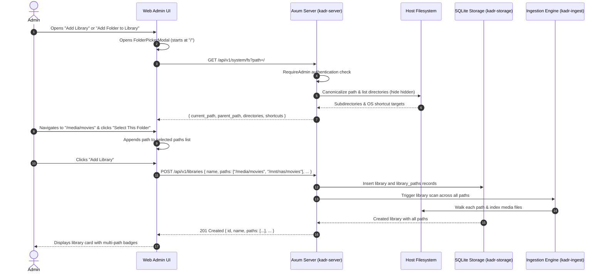

# Design Specification: Filesystem Selector & Multi-Path Media Libraries

**Document Version:** 1.0.0  
**Date:** 2026-10-04  
**Status:** Approved  
**Author:** Antigravity Team  

---

## 1. Overview & Objectives

In the Kadr Web Admin interface, configuring media libraries currently requires manually typing an absolute folder path into a text field. Additionally, each media library is restricted to a single storage directory on the host server.

This feature introduces:
1. **Interactive Server Filesystem Selector**: An interactive modal dialog (`FolderPickerModal`) that allows administrators to browse directories on the host server, jump using OS shortcut pills (e.g. `/`, `/media`, `/mnt`, `/home`), navigate via breadcrumbs, and select folders without typing raw path strings.
2. **Multi-Path Media Libraries**: Support for configuring multiple storage directories per media library (e.g., across multiple drives or mount points), both during initial library creation and on existing libraries.
3. **Multi-Path Ingestion & Monitoring**: Updating library scanning and directory monitoring to index and watch media items across all configured folder paths.

---

## 2. Architecture & Data Flow



---

## 3. Database Schema & Storage Layer

### 3.1 Migration `006_multiple_library_paths.sql`
A dedicated relational table links multiple paths to a single library, supporting indexing, uniqueness per library, and cascading deletions:

```sql
-- Migration 006: Multiple Library Paths
CREATE TABLE IF NOT EXISTS library_paths (
    id INTEGER PRIMARY KEY AUTOINCREMENT,
    library_id TEXT NOT NULL REFERENCES libraries(id) ON DELETE CASCADE,
    path TEXT NOT NULL,
    created_at INTEGER NOT NULL,
    UNIQUE(library_id, path)
);

-- Seed existing library paths into the new table
INSERT OR IGNORE INTO library_paths (library_id, path, created_at)
SELECT id, path, created_at FROM libraries WHERE path IS NOT NULL AND path != '';

CREATE INDEX IF NOT EXISTS idx_library_paths_lib ON library_paths(library_id);
CREATE INDEX IF NOT EXISTS idx_library_paths_path ON library_paths(path);
```

### 3.2 Domain Models (`kadr-core`)
The `Library` model maintains `path: PathBuf` (representing the primary/first path) for backward compatibility, while adding `paths: Vec<PathBuf>`:

```rust
#[derive(Debug, Clone, PartialEq, Eq, Serialize, Deserialize)]
pub struct Library {
    pub id: String,
    pub name: String,
    pub path: PathBuf,            // Primary path (paths[0]) for backward compatibility
    #[serde(default)]
    pub paths: Vec<PathBuf>,      // All configured folders for this library
    pub media_type: MediaType,
    pub is_private: bool,
    #[serde(default, skip_serializing)]
    pub pin_hash: Option<String>,
    pub created_at: i64,
}
```

### 3.3 Storage Repository (`LibraryRepo` in `kadr-storage`)
- `create`: Accepts `name, paths: Vec<PathBuf>, media_type, is_private, pin_hash`. Inserts into `libraries` (with `path = paths[0]`) and inserts each path into `library_paths`.
- `add_path(&self, library_id: &str, path: &str) -> Result<()>`: Inserts a new path into `library_paths`.
- `remove_path(&self, library_id: &str, path: &str) -> Result<()>`: Deletes the path from `library_paths`. Fails if it is the only remaining path for the library.
- `get_by_id` & `get_all`: Queries `libraries` and joins or queries `library_paths` to populate `lib.paths` (defaulting to `vec![lib.path]` if `library_paths` is empty).

---

## 4. Backend REST API (`kadr-server`)

### 4.1 Server Filesystem Browsing API
**Endpoint:** `GET /api/v1/system/fs?path={directory_path}`
- **Security & Authorization:** Restricted to users with the `RequireAdmin` role.
- **Path Resolution:**
  - If `path` query param is empty or missing, defaults to `/`.
  - Canonicalizes the path and verifies `path.is_dir()`. Returns `400 Bad Request` if invalid or not a directory.
- **Directory Traversal:**
  - Uses `tokio::fs::read_dir`.
  - Filters entries to subdirectories (`file_type.is_dir()`).
  - Filters out hidden directories (names starting with `.`).
  - Sorts alphabetically case-insensitive.
- **Shortcuts:**
  - Checks existence of common system media roots: `/`, `/media`, `/mnt`, `/home`, `/var`.
- **Response Format:**
  ```json
  {
    "current_path": "/media",
    "parent_path": "/",
    "directories": [
      { "name": "movies", "path": "/media/movies" },
      { "name": "shows", "path": "/media/shows" }
    ],
    "shortcuts": [
      { "name": "Root (/)", "path": "/" },
      { "name": "Media", "path": "/media" },
      { "name": "Mounts", "path": "/mnt" },
      { "name": "Home", "path": "/home" }
    ]
  }
  ```

### 4.2 Library Management Endpoints
1. `POST /api/v1/libraries`:
   - Updated payload:
     ```json
     {
       "name": "Movies",
       "paths": ["/media/movies", "/mnt/external/movies"],
       "media_type": "movies",
       "is_private": false
     }
     ```
   - Legacy fallback: If `paths` is missing or empty, checks `path: Option<String>`.
   - Validates that at least one path is specified and all paths exist and are valid directories.
2. `POST /api/v1/libraries/{id}/paths`:
   - Body: `{ "path": "/new/storage/dir" }`
   - Validates existence, inserts into `library_paths`, and schedules an ingest scan.
3. `DELETE /api/v1/libraries/{id}/paths?path={encoded_path}`:
   - Removes path from `library_paths`.
   - Returns `400 Bad Request` if attempting to delete the last remaining path for the library.

### 4.3 Ingestion & Scanner Multi-Pathing
- `POST /api/v1/libraries/{id}/scan`:
  - Iterates over all paths in `library.paths` and runs the scanner over each directory tree.
- `kadr-ingest` Directory Watcher:
  - Registers notify watches on all directories listed in `library.paths`.

---

## 5. Frontend Web UI (`web/`)

### 5.1 `FolderPickerModal.tsx`
- **Modal Dialog:**
  - Built with Tailwind v4 theme tokens (`bg-panel`, `border-border-subtle`, `text-text-main`, `bg-canvas`).
  - Displays current path with interactive breadcrumb links.
  - Shortcut pills row (`/`, `/media`, `/mnt`, `/home`).
  - Directory list with folder icons, hover states (`bg-panel-hover`), and double-click or single-click entry.
  - "Up" button when `parent_path` is present.
  - Bottom action bar:
    - Primary CTA: **"Select This Folder"** (`bg-cta hover:bg-cta-hover text-white rounded-xl`).
    - Secondary: **"Cancel"** (`text-muted hover:text-text-main`).

### 5.2 Add Library Modal (`AdminDashboard.tsx`)
- Removes manual text input `<input name="path" ... />`.
- Renders:
  - List of selected folder tags (with folder icon and `✕` remove button).
  - Empty state text: *"No folders selected yet. Click 'Add Server Folder' to browse."*
  - **"+ Add Server Folder"** button opening `FolderPickerModal`.
  - Disables form submission if 0 paths are selected.

### 5.3 Existing Library Cards (`AdminDashboard.tsx`)
- Under the library header, renders the list of configured directory paths.
- Each path has a remove button (disabled with explanation if only 1 path remains).
- Inline **"+ Add Folder"** button opening `FolderPickerModal` to append a directory directly to the library.

---

## 6. Security & Error Handling

1. **Host Traversal Safeguards**:
   - The filesystem browsing endpoint is strictly protected by `RequireAdmin`. Regular users and unauthenticated callers receive `401 Unauthorized` or `403 Forbidden`.
   - Paths are strictly checked with `std::path::Path::is_dir()`. No arbitrary file reading or command execution is permitted.
2. **Hidden Directory Filtering**:
   - Hidden files and folders (`.*`) are filtered by default to avoid accidental exposure of system internals or dotfiles.
3. **Fail-Closed Minimum Path Constraint**:
   - A library must always have at least 1 directory path. Deleting the last path is rejected with `400 Bad Request`.
4. **Foreign Key Integrity**:
   - `library_paths` has `ON DELETE CASCADE` referencing `libraries(id)`. Deleting a library automatically cleans up all associated path records.

---

## 7. Verification & Testing Strategy

1. **Storage Tests (`kadr-storage`)**:
   - Test migration `006_multiple_library_paths.sql` seeds existing paths.
   - Test `LibraryRepo::create` with multiple paths.
   - Test `LibraryRepo::add_path` and `LibraryRepo::remove_path`.
   - Test error when removing the final path.
2. **API & Server Tests (`kadr-server`)**:
   - Test `GET /api/v1/system/fs` returns directories and shortcuts.
   - Test `GET /api/v1/system/fs` with non-admin token returns 403 Forbidden.
   - Test `POST /api/v1/libraries` with multiple paths.
   - Test `POST /api/v1/libraries/{id}/paths` and `DELETE /api/v1/libraries/{id}/paths`.
3. **Frontend Vitest Component Tests (`web/`)**:
   - Test `FolderPickerModal`: navigation, shortcut clicks, folder selection, and cancel.
   - Test `AdminDashboard`: multi-path badge rendering, adding paths via picker, removing paths, and form submission validation.
4. **Full Workspace Build & Clippy**:
   - Verify `cargo test --workspace` passes cleanly.
   - Verify `cargo clippy --workspace --all-targets -- -D warnings` has 0 warnings.
   - Verify `npm test -- --run` and `npm run build` succeed in `web/`.
