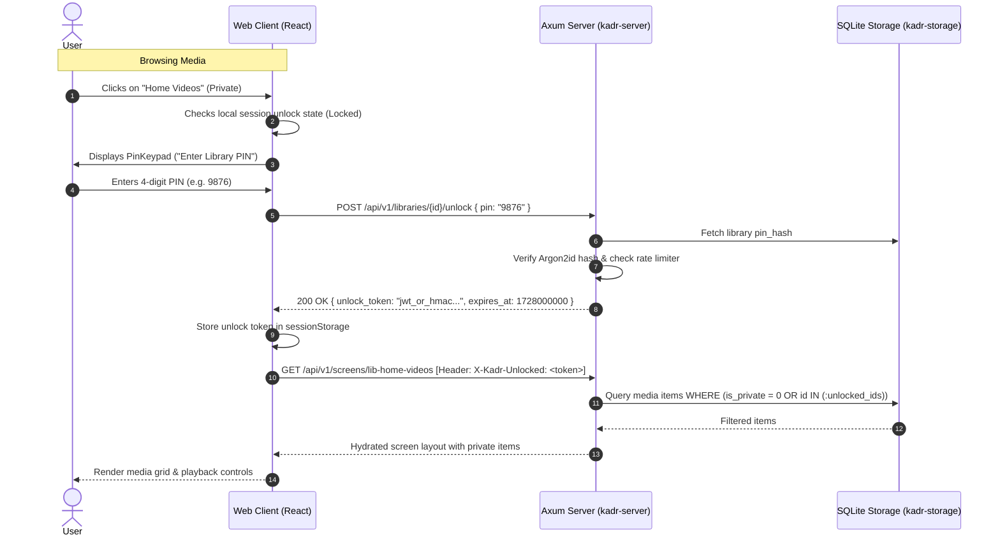

# Design Specification: Private Library with PIN Protection

**Document Version:** 1.0.0  
**Date:** 2026-10-04  
**Status:** Approved  
**Author:** Antigravity Team  

---

## 1. Overview & Objectives

The **Private Library** feature allows users and administrators to designate any media library (e.g. Movies, TV Shows, Home Videos) as **Private**, protecting its media items, metadata, and video stream routes behind a 4-digit PIN.

### Key Requirements
1. **Per-Library Privacy Flag**: Any regular library can be marked as private and configured with a 4-digit numeric PIN at creation time or through the Web UI Library Management interface.
2. **Lock Badging & Prompting**: Private libraries appear in navigation and library listings with a visible Lock icon/badge. Clicking an unlocked private library prompts for its 4-digit PIN via the cinema-styled PIN keypad.
3. **Session-Scoped Unlocking**: Once unlocked, a library remains unlocked for the active user session until explicitly re-locked, signed out, or the browser session ends.
4. **Strict Isolation & Authorization**: While locked, items belonging to private libraries are excluded from Home screen carousels, Spotlight, Continue Watching, Search, and direct video streaming (`/api/v1/stream/*`). Video chunks and metadata are guarded at both the database and HTTP layer using ephemeral unlock tokens.
5. **Admin Configuration in Web UI**: The "+ Add Library" modal in the Admin Dashboard includes a "Private Library" toggle and 4-digit PIN input with validation.

---

## 2. Architecture & Data Flow



---

## 3. Database Schema & Storage Layer

### 3.1 Migration `005_private_libraries.sql`
```sql
ALTER TABLE libraries ADD COLUMN is_private INTEGER NOT NULL DEFAULT 0;
ALTER TABLE libraries ADD COLUMN pin_hash TEXT DEFAULT NULL;
CREATE INDEX idx_libraries_private ON libraries(is_private);
```

### 3.2 Domain Models (`kadr-core`)
```rust
#[derive(Debug, Clone, PartialEq, Eq, Serialize, Deserialize)]
pub struct Library {
    pub id: String,
    pub name: String,
    pub path: PathBuf,
    pub media_type: MediaType,
    pub is_private: bool,
    #[serde(skip_serializing)]
    pub pin_hash: Option<String>,
    pub created_at: i64,
}
```

### 3.3 Storage Repository Queries (`kadr-storage`)
- In `media_item_repo.rs` and `widget_queries.rs`, all select queries that aggregate media items receive an optional list of `unlocked_library_ids: &[String]`:
  ```sql
  WHERE (l.is_private = 0 OR l.id IN (?1, ?2, ...))
  ```
- Direct item lookup (`get_by_id`) and streaming verification join the parent library and verify that if `is_private == true`, the library ID is in the caller's unlocked set.

---

## 4. Backend REST API (`kadr-server`)

### 4.1 Endpoints
1. `GET /api/v1/libraries`:
   - Returns array of `LibraryResponse` objects with `is_private: bool`.
   - Never exposes `pin_hash`.
2. `POST /api/v1/libraries`:
   - Accepts `CreateLibraryRequest { name, path, media_type, is_private: Option<bool>, pin: Option<String> }`.
   - If `is_private` is true, requires `pin` to be 4 numeric digits (`^\d{4}$`).
   - Hashes `pin` using Argon2id with random salt before persisting.
3. `POST /api/v1/libraries/{id}/unlock`:
   - Accepts `{ pin: "..." }`.
   - Reuses `PinRateLimiter` to lock out after 5 consecutive failed attempts.
   - On success, generates a signed HMAC-SHA256 token encoding `{ library_id, exp }`.
   - Response:
     ```json
     {
       "library_id": "lib-123",
       "token": "...",
       "expires_at": 1728000000
     }
     ```
4. `POST /api/v1/libraries/{id}/pin`:
   - (Admin only) Change or reset PIN for a private library, or toggle privacy status.

### 4.2 Request Authentication & Header Extraction
- A middleware/extractor `UnlockedLibraries` inspects `X-Kadr-Unlocked: <token1>,<token2>`.
- Valid tokens are decoded and passed down into route handlers, resolving to a `HashSet<String>` of unlocked library IDs.
- Unlocked IDs are forwarded to the storage layer and widget resolvers.
- If an unauthorized request targets a private media stream (`/api/v1/stream/{item_id}`), the server responds with `403 Forbidden` (`{"error": "LIBRARY_LOCKED"}`).

---

## 5. Frontend Web UI (`web/`)

### 5.1 Admin Dashboard: Library Management
- **Add Library Modal**:
  - Adds a "Private Library" toggle switch with a `Lock` icon.
  - When enabled, displays a 4-digit PIN input with number mask and validation.
- **Library Cards List**:
  - Displays a yellow `Private` badge with a `Lock` icon next to the media type badge (`Movie` / `TV Shows`).
  - Context menu / action button to modify PIN or toggle privacy.

### 5.2 Browsing & Media Player Integration
- **Navigation Tabs / Library Rail**:
  - Private libraries display a lock icon:
    - Locked: `Lock` icon (Amber/Zinc).
    - Unlocked: `Unlock` icon with optional "Lock" button in header.
- **Unlock Prompt**:
  - When a user selects a locked library, the existing `PinKeypad` modal is invoked with title *"Unlock [Library Name]"*.
  - Incorrect PIN shows inline error feedback with remaining attempts.
  - Successful entry stores the token in `sessionStorage` under `kadr_unlocked_libraries` and transitions smoothly into the library view.
- **Client API Integration**:
  - `client.ts` automatically attaches all active unlock tokens to the `X-Kadr-Unlocked` header on every outgoing API request.
  - Video player (`CinemaPlayer`) passes the token query param or header when requesting media streams.
- **Session Cleanup**:
  - Logging out or switching user profiles immediately removes all unlock tokens from state and `sessionStorage`.

---

## 6. Testing Strategy

1. **Storage Unit Tests (`kadr-storage`)**:
   - Migration `005_private_libraries.sql` applies cleanly on existing databases.
   - `LibraryRepo` persists `is_private` and `pin_hash`.
   - `MediaItemRepo` and widget queries omit items from private libraries unless `unlocked_library_ids` contains the matching ID.
2. **Server API Tests (`kadr-server`)**:
   - `POST /api/v1/libraries` with valid 4-digit PIN creates a private library.
   - `POST /api/v1/libraries/{id}/unlock` validates PIN with Argon2id and returns signed token.
   - Rate limiting locks out after 5 invalid attempts.
   - `/api/v1/stream/{item_id}` returns 403 Forbidden without valid unlock token, and 206 Partial Content when unlocked.
3. **Frontend Vitest Component Tests (`web/src/components/...`)**:
   - `AdminDashboard.test.tsx`: Validates adding a private library with 4-digit PIN.
   - `PinKeypad.test.tsx` / `BrowseScreen.test.tsx`: Renders lock badges, invokes PIN prompt when clicking locked libraries, and stores unlock token on success.
