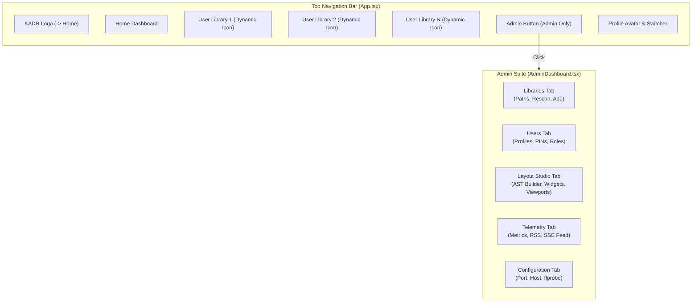

# Streamlined Top Navigation & Unified Admin Suite Design Specification

## Overview
This specification details the frontend architectural updates to streamline Kadr's top navigation bar for daily consumer media consumption while consolidating administrative, developer, and telemetry tooling into a unified Admin Suite.

---

## 1. Background & Motivation
* **Current State**:
  * Top navigation in `App.tsx` includes hardcoded buttons for `"Movies"` and `"Shows"`, even if the user hasn't added libraries for them or uses different media types (e.g. Anime, Music, Home Videos).
  * Top navigation also displays developer/administrative tools (`"Studio"` and `"Telemetry"`) directly in the consumer header, cluttering the primary viewing experience.
* **Goals**:
  * Remove hardcoded `"Movies"` and `"Shows"` tabs from the top navigation.
  * Remove `"Studio"` and `"Telemetry"` tabs from the top navigation.
  * Render only the user's actual libraries dynamically in the top navigation, with dynamic icons corresponding to their `media_type`.
  * Move **Layout Studio** and **System Telemetry** into `AdminDashboard` as first-class administrative tabs alongside Libraries, Users, and Configuration.

---

## 2. Navigation Architecture



---

## 3. Detailed Component Specifications

### 3.1 App Header (`web/src/App.tsx`)
* **Navigation Items**:
  1. **Brand Logo** (`KADR`): Navigates to `'home'`.
  2. **Home Tab**:
     * Icon: `Home`
     * Label: `Home`
     * View: `'home'` (renders `BrowseScreen` with global `screenId="home"`).
  3. **Dynamic Library Tabs**:
     * Iterates over `libraries` from `api.getLibraries()`.
     * Dynamic Media Type Icon helper `getLibraryIcon(mediaType: MediaType)`:
       * `movie` / `Movie`: `<Film className="h-4 w-4" />`
       * `show` / `Show`: `<Tv className="h-4 w-4" />`
       * `anime` / `Anime`: `<Sparkles className="h-4 w-4" />`
       * `music` / `Music`: `<Music className="h-4 w-4" />`
       * `home_videos` / `HomeVideos`: `<Video className="h-4 w-4" />`
       * `audiobook` / `Audiobook`: `<BookOpen className="h-4 w-4" />`
       * Fallback: `<Folder className="h-4 w-4" />`
     * Private libraries show `<Lock className="h-4 w-4 text-highlight" />` or `<Unlock className="h-4 w-4 text-accent" />`.
     * View: `'library-${lib.id}'`.
  4. **Admin Tab** (Conditional on `currentUser?.role === 'admin'`):
     * Icon: `Settings`
     * Label: `Admin`
     * View: `'admin'`.
* **Removed Tabs**:
  * Hardcoded `Movies` button.
  * Hardcoded `Shows` button.
  * `Studio` button.
  * `Telemetry` button.
* **View Rendering**:
  * When `currentView === 'admin'`: renders `<AdminDashboard onPlayItem={handlePlayItem} />`.

---

### 3.2 Unified Admin Dashboard (`web/src/components/admin/AdminDashboard.tsx`)
* **Admin Tab Type**:
  ```typescript
  export type AdminTab = 'libraries' | 'users' | 'studio' | 'telemetry' | 'config';
  ```
* **Props**:
  ```typescript
  export interface AdminDashboardProps {
    onClose?: () => void;
    onPlayItem?: (itemId: number) => void;
  }
  ```
* **Tab Controls**:
  * Horizontal pill tabs styled with theme tokens (`bg-accent text-canvas font-semibold` when active; `text-muted hover:text-text-main hover:bg-panel-hover` when inactive; 10-foot focus ring `focus-visible:ring-3 focus-visible:ring-highlight`):
    1. **Libraries** (`Folder` icon, label: `"Libraries"`)
    2. **User Profiles** (`Users` icon, label: `"Users"`)
    3. **Layout Studio** (`Layout` icon, label: `"Layout Studio"`)
    4. **System Telemetry** (`Activity` icon, label: `"Telemetry"`)
    5. **Server Config** (`Settings` icon, label: `"Configuration"`)
* **Tab Content Rendering**:
  * `'libraries'`: Library cards, Add Library modal with multi-path picker, rescan action.
  * `'users'`: Profile cards, Add User modal, PIN and role assignment.
  * `'studio'`: `<LayoutStudio onPlayItem={onPlayItem} />` embedded cleanly with full interactive canvas.
  * `'telemetry'`: `<TelemetryDashboard />` embedded with real-time RSS metrics and SSE feed.
  * `'config'`: Server host, port, debounce, and ffprobe parameters.

---

## 4. Verification & Testing Strategy
* **Vitest Component Tests (`web/`)**:
  * `web/src/App.test.tsx`:
    * Verify top navigation renders `Home` and active user libraries.
    * Verify hardcoded `Movies`, `Shows`, `Studio`, and `Telemetry` buttons are not present in top nav.
    * Verify clicking a library tab navigates to that library's content.
    * Verify clicking `Admin` tab navigates to the Admin view.
  * `web/src/components/admin/AdminDashboard.test.tsx`:
    * Verify all 5 admin tabs (`Libraries`, `Users`, `Layout Studio`, `Telemetry`, `Configuration`) render in the tab bar.
    * Verify clicking `"Layout Studio"` tab renders the layout studio components.
    * Verify clicking `"Telemetry"` tab renders the telemetry dashboard components.
* **Workspace Verification**:
  * `cd web && npm test -- --run`
  * `cd web && npm run build`
  * `cargo test --workspace`
  * `cargo clippy --workspace --all-targets -- -D warnings`
