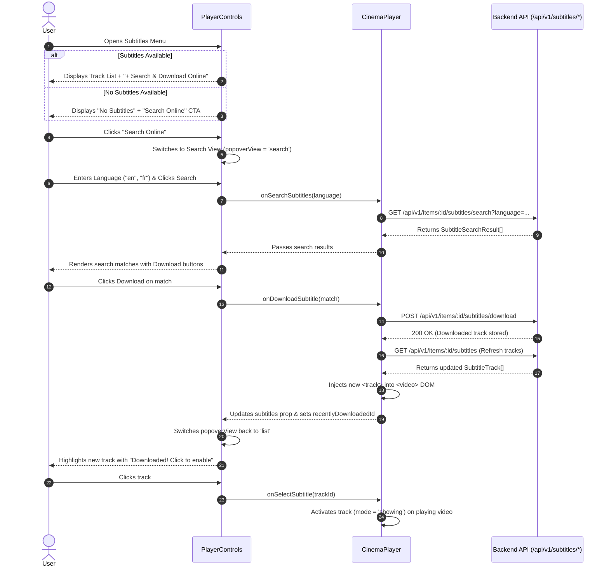

# In-Player Live Subtitle Search & Download Design Specification

## Overview
This specification details the architecture, UI components, data flow, and error handling for searching and downloading subtitles directly inside the video player HUD during playback in Kadr.

---

## 1. Background & Goals
* **Problem**:
  * Currently, when watching a video in `CinemaPlayer.tsx` / `PlayerControls.tsx`, the subtitles menu only lists tracks that are already locally available. If no local subtitles exist, or if the user wants an alternate language, they have to exit playback completely, go back to the media browser, open the `ItemDetailsModal`, search and download subtitles there, and then restart the video.
* **Goals**:
  * Enable users to search OpenSubtitles and download subtitles directly inside the player HUD without exiting playback or leaving the video.
  * When no local subtitles exist, present an immediate *"Search Online"* CTA in the player's subtitle popover.
  * When local subtitles do exist, offer a `+ Search & Download Online` option at the bottom of the track list.
  * Provide an inline search drawer inside the subtitle popover with language filtering, search results, and 1-click download.
  * When a subtitle is downloaded, immediately inject it into the video player's tracks, return to the track list, and prompt the user to enable it.
  * Strictly adhere to Kadr design tokens (`theme.md`) and 10-foot TV UI focus rings.

---

## 2. Architecture & Data Flow



---

## 3. Component & UI Specifications

### 3.1 `PlayerControls.tsx`
* **Props Expansion**:
  ```typescript
  export interface PlayerControlsProps {
    // ... existing playback and control props ...
    onSearchSubtitles?: (language: string) => Promise<SubtitleSearchResult[]>;
    onDownloadSubtitle?: (result: SubtitleSearchResult) => Promise<void>;
    recentlyDownloadedId?: number | null;
  }
  ```
* **Internal States**:
  * `isSubtitlesMenuOpen: boolean`
  * `popoverView: 'list' | 'search'`
  * `searchLang: string` (default: `'en'`)
  * `searchResults: SubtitleSearchResult[]`
  * `isSearching: boolean`
  * `searchError: string | null`
  * `downloadingId: string | null`
  * `downloadError: string | null`
* **List View UI**:
  * Title header: `"Subtitles"`
  * If `recentlyDownloadedId` is set, displays an alert banner:
    `"Subtitle downloaded! Click below to display on screen."`
  * Options:
    * `Off` (with checkmark if `activeSubtitleId === null`).
    * Each track in `subtitles`: title/language, format tag (`SRT`), source badge (`Downloaded` or `Embedded`), with checkmark if active.
  * Empty state (when `subtitles.length === 0`):
    * Notice text: *"No subtitle tracks found on server"*
    * Button: **`Search OpenSubtitles Online`** (switches `popoverView` to `'search'`).
  * Action button (when `subtitles.length > 0`):
    * **`+ Search & Download Online`** (switches `popoverView` to `'search'`).
* **Search View UI**:
  * Header: Button with `ArrowLeft` icon: **`← Back to Subtitles`** (resets to `'list'`).
  * Search Bar:
    * Input field: `placeholder="Language (e.g. en, fr, es, ar)..."` with `text-text-main`, `bg-canvas/60`, `border-border-subtle`.
    * Button: **`Search`** (`bg-cta hover:bg-cta-hover text-white rounded-xl`). Shows `<Loader2 className="animate-spin" />` while searching.
  * Results Container (max height 240px, scrollable):
    * Header: `Found N matches`
    * Each match card: release name/title, language tag, format, and **`Download`** CTA button.
    * Download button shows loading spinner when `downloadingId === match.id`.
  * Error feedback:
    * Displays error banner if search or download fails (`bg-cta/15 text-cta border border-cta/40`).

---

### 3.2 `CinemaPlayer.tsx`
* **Handlers**:
  * `handleSearchSubtitles`:
    ```typescript
    const handleSearchSubtitles = async (language: string): Promise<SubtitleSearchResult[]> => {
      return api.searchSubtitles(itemId, undefined, language);
    };
    ```
  * `handleDownloadSubtitle`:
    ```typescript
    const handleDownloadSubtitle = async (result: SubtitleSearchResult): Promise<void> => {
      await api.downloadSubtitle(itemId, result);
      const updatedTracks = await api.getSubtitles(itemId);
      setSubtitles(updatedTracks);
      // Find the newly added track to pass its ID
      const latestDownloaded = updatedTracks.find(
        (t) => t.source === 'downloaded' && (!subtitles.some((old) => old.id === t.id))
      );
      if (latestDownloaded) {
        setRecentlyDownloadedId(latestDownloaded.id);
      }
    };
    ```
* **Video Element Sync**:
  * The video element dynamically maps `subtitles.map((track) => (<track key={track.id} id={track.id} ... />))`.
  * As soon as `subtitles` state updates, the new `<track>` exists in the DOM.
  * Clicking the newly downloaded track sets `activeSubtitleId`, which enables `textTrack.mode = 'showing'`.

---

## 4. Error Handling & Edge Cases
1. **OpenSubtitles API Unconfigured**:
   * If server responds with 400 Bad Request, displays: *"OpenSubtitles is not configured on this server."*
2. **Zero Results**:
   * Displays: *"No subtitles found for this language. Try another language code."*
3. **Download Interruption / Network Failure**:
   * Displays: *"Download failed. Please try another subtitle release."*
   * Video playback continues uninterrupted.
4. **HUD Autohide Suspension**:
   * While the subtitle search menu or popover is open, the HUD autohide timer is suspended so user input is never interrupted mid-typing.

---

## 5. Verification & Testing Plan
* **Vitest Component Tests (`web/src/components/player/`)**:
  * `PlayerControls.test.tsx`:
    * Verify subtitles popover shows "Search OpenSubtitles Online" when 0 subtitles exist.
    * Verify switching from list view to search view.
    * Verify search triggers `onSearchSubtitles` and renders results.
    * Verify clicking download triggers `onDownloadSubtitle` and shows loading state.
    * Verify success banner prompt after downloading.
  * `CinemaPlayer.test.tsx`:
    * Verify integration between `CinemaPlayer` subtitle methods and `PlayerControls`.
* **Workspace Verification**:
  * `cd web && npm test -- --run`
  * `cd web && npm run build`
  * `cargo test --workspace`
