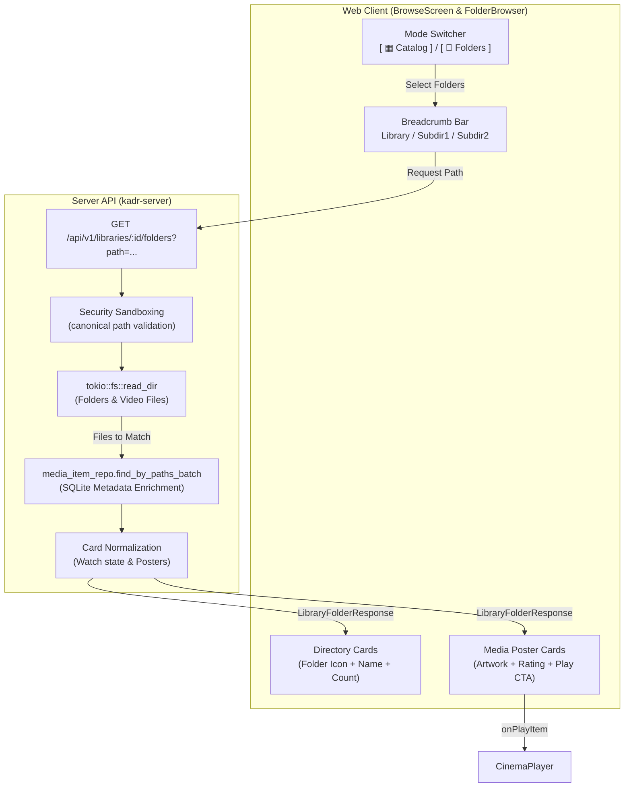

# Library Hierarchical Folder Browser Design Specification

## Overview
This specification details the architecture, security sandboxing, backend API, and user interface for browsing media libraries through a hierarchical, filesystem-like folder browser in Kadr.

---

## 1. Background & Motivation
* **Problem**:
  * Currently, media libraries are presented exclusively as flat catalog screens (Spotlights, Carousels, or Grids) generated from declarative AST layouts or database queries.
  * Users with organized folder structures on disk (e.g., `Movies/4K UHD/`, `Movies/Foreign/`, `Anime/Series/Season 01/`) cannot browse their actual directory hierarchy to locate and select files, making deep catalog navigation rigid.
* **Goals**:
  * Implement a secure, sandboxed backend directory traversal endpoint: `GET /api/v1/libraries/{id}/folders?path=...`.
  * Batch-enrich detected video files with existing SQLite database metadata (posters, ratings, runtime, playback progress) into normalized `CardViewModel`s.
  * Provide an intuitive mode switcher in `BrowseScreen.tsx`: `[ ▦ Catalog ]` vs `[ 📁 Folders ]`.
  * Implement `FolderBrowser.tsx` featuring breadcrumb trail navigation, "Up one level" navigation, responsive directory cards, and rich cinematic media poster cards with 1-click play and modal details.
  * Strictly adhere to Kadr design tokens (`theme.md`) and 10-foot TV UI focus rings.

---

## 2. Architecture & Data Flow



---

## 3. Detailed Specifications

### 3.1 Backend API & Sandboxing (`crates/kadr-server`)

#### Endpoint
`GET /api/v1/libraries/{id}/folders?path={optional_subpath}`

#### Authentication & Authorization
* Requires authenticated user (`AuthUser`).
* If `library.is_private == true`, verifies that `{id}` is present in `UnlockedLibraries`, returning `403 Forbidden` if locked.

#### Path Resolution & Security Sandboxing
1. The `path` parameter is an optional relative path (default: `""`).
2. If `path` is empty and the library has multiple root paths (`library.paths.len() > 1`), the root view returns each configured root directory as a top-level folder card (e.g. `"Drive 1"`, `"Drive 2"`).
3. If `path` is specified, the server resolves it against the library's root paths:
   * Rejects any path containing `..`, null bytes, or absolute path prefixes.
   * Resolves `canonicalize()` and verifies `resolved.starts_with(&root_canonical)`.
   * Returns `400 Bad Request` if path escaping is attempted.
   * Returns `404 Not Found` if the directory does not exist on disk.

#### Directory Scanning & DB Batch Lookup
* Traverses the target directory using `tokio::fs::read_dir`:
  * Ignores hidden files/folders (`entry.file_name().starts_with('.')`).
  * **Directories**: Counts valid entries inside each subdirectory and constructs `FolderEntry { name, path: relative_subpath, item_count }`.
  * **Files**: Filters by supported video file extensions: `.mkv`, `.mp4`, `.avi`, `.mov`, `.webm`, `.m4v`, `.ts`.
* Queries database with `media_item_repo.find_by_paths_batch(&video_file_paths)`:
  * Matched items are enriched into `CardViewModel`s (including title, poster URL, rating, release year, duration, and playback progress).
  * Any video file on disk that has not completed metadata scraping produces a graceful fallback `CardViewModel` using its filename and a default video icon so it remains playable immediately.

#### Response DTO (`LibraryFolderResponse`)
```json
{
  "library_id": "lib-uuid",
  "library_name": "Movies",
  "current_path": "Action/Sci-Fi",
  "parent_path": "Action",
  "breadcrumbs": [
    { "name": "Movies", "path": "" },
    { "name": "Action", "path": "Action" },
    { "name": "Sci-Fi", "path": "Action/Sci-Fi" }
  ],
  "directories": [
    {
      "name": "Interstellar (2014)",
      "path": "Action/Sci-Fi/Interstellar (2014)",
      "item_count": 2
    }
  ],
  "items": [
    {
      "id": 105,
      "title": "Interstellar",
      "media_type": "movie",
      "poster_url": "/api/v1/images/interstellar.jpg",
      "release_year": 2014,
      "rating": 8.7,
      "playback_progress": 0.65
    }
  ]
}
```

---

### 3.2 Frontend UI Components (`web/src/components/browse/`)

#### 1. Mode Switcher (`BrowseScreen.tsx`)
* When browsing a library (i.e. `screenId` matches an active library ID or is a library route), renders a segmented toggle in the top-right header:
  * `[ ▦ Catalog ]` (Default): Declarative AST layout widgets.
  * `[ 📁 Folders ]`: Renders `<FolderBrowser libraryId={screenId} onPlayItem={onPlayItem} />`.
* Styled using theme tokens:
  * Active: `bg-accent text-canvas font-semibold shadow-sm`
  * Inactive: `text-muted hover:text-text-main hover:bg-panel-hover`
  * Focus rings: `focus-visible:ring-3 focus-visible:ring-highlight focus-visible:outline-none`

#### 2. Folder Browser (`FolderBrowser.tsx`)
* **State**:
  * `currentPath: string`: Currently active relative path (default: `""`).
  * `data: LibraryFolderResponse | null`: Fetched folder payload.
  * `loading: boolean` & `error: string | null`.
  * `selectedItemId: number | null`: Controls `ItemDetailsModal`.
* **Breadcrumb Navigation**:
  * Clickable breadcrumbs styled with `text-sm font-medium`:
    `Home / Movies / Action / Sci-Fi`
  * Clicking any breadcrumb jumps directly to that ancestor folder.
  * Quick **`← Up one level`** button when `currentPath !== ""` navigating to `data.parent_path`.
* **Directories Grid**:
  * Displayed in a responsive 2 to 4-column grid above media items.
  * Folder Card design:
    * Folder icon in Radiant Accent (`#FF6B00`).
    * Truncated folder name (`text-text-main font-semibold`).
    * Item count badge in `font-mono text-xs text-muted bg-canvas/60 px-2 py-0.5 rounded-md`.
    * Hover elevation: `bg-panel hover:bg-panel-hover border border-border-subtle rounded-2xl p-4`.
    * Clicking navigates into the folder (`setCurrentPath(dir.path)`).
* **Media Cards Grid**:
  * Responsive 4 to 6-column grid displaying all video items in the current directory.
  * Reuses standard Kadr poster cards:
    * Poster image with fallback icon.
    * Rating badge (`bg-highlight/20 text-highlight`).
    * Resume progress bar (`bg-accent` progress over `bg-muted` track).
    * Hover play CTA overlay (`#D43F15`).
    * Clicking play triggers `onPlayItem(item.id)`.
    * Clicking card opens `ItemDetailsModal` for technical details and subtitles.
* **Empty Folder State**:
  * If both `directories` and `items` are empty: renders a clean empty state with `FolderOpen` icon and *"This directory is empty."*

---

## 4. Error Handling & Edge Cases
1. **Directory Traversal Attack**: Any path attempting `../` or resolving outside the library root returns `400 Bad Request`.
2. **Missing Folder / Moved on Disk**: Returns `404 Not Found` with a message *"Directory not found on disk."* Frontend displays error with a *"← Back to Root"* button.
3. **Locked Private Library**: Returns `403 Forbidden` if unlock token is missing. Frontend opens the PIN keypad.
4. **Unindexed Video Files**: Video files detected on disk that do not yet exist in SQLite are rendered with fallback titles from their filenames and queued for playback or ingestion.

---

## 5. Verification & Testing Plan
* **Rust Integration Tests (`crates/kadr-server/tests/library_folder_routes_test.rs`)**:
  * Test `GET /api/v1/libraries/{id}/folders` returns root subdirectories and media items.
  * Test deep subpath navigation (`?path=Action/Sci-Fi`).
  * Test path traversal rejection (e.g. `?path=../../etc`).
  * Test private library authorization (403 without unlock token, 200 with token).
* **Vitest Component Tests (`web/src/components/browse/`)**:
  * `FolderBrowser.test.tsx`:
    * Verify breadcrumbs rendering and navigation.
    * Verify clicking folder card updates path and fetches subfolder.
    * Verify media cards display with posters and playback triggers.
    * Verify "Up one level" button.
  * `BrowseScreen.test.tsx`:
    * Verify mode toggle switches between Catalog and Folders views.
* **Workspace Verification**:
  * `cd web && npm test -- --run`
  * `cd web && npm run build`
  * `cargo test --workspace`
  * `cargo clippy --workspace --all-targets -- -D warnings`
