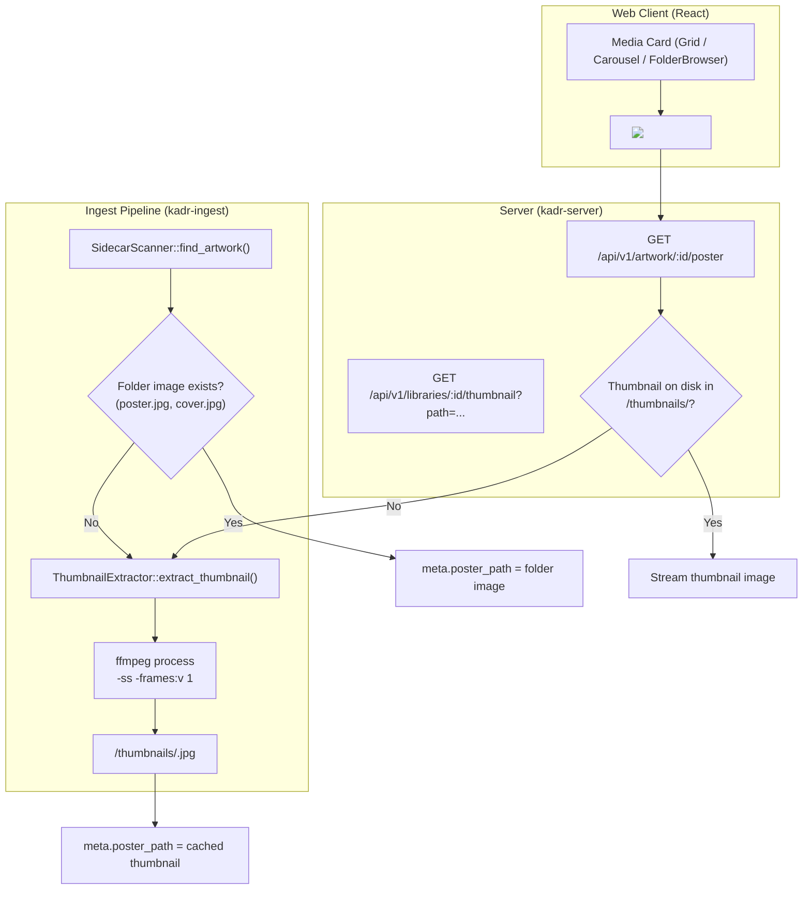

# Video Thumbnail Extraction Design Specification

## Overview
This specification details the architecture, thumbnail extraction engine, storage caching, backend API routes, and user interface integration for extracting and displaying video thumbnails when no sidecar artwork image (`poster.jpg`, `cover.jpg`, etc.) exists in a media item's directory.

---

## 1. Background & Motivation
* **Problem**:
  * Currently, when a user adds a video without a dedicated poster image in its folder, Kadr leaves `item.metadata.poster_path` empty (`None`), causing `/api/v1/artwork/{id}/poster` to return `404 Not Found`.
  * Consequently, all video cards in carousels, grids, search results, and the library folder browser display a generic placeholder `Film` icon instead of a visual preview of the video content.
* **Goals**:
  * Implement an automatic thumbnail extractor using `ffmpeg` wrapped in pure Rust process execution (preserving the zero-native-C dependency musl baseline).
  * Automatically capture a video frame at a dynamic timestamp (10% into the video or 15 seconds) during ingestion if no folder artwork exists.
  * Store generated thumbnails in the server's internal cache directory (`<data_dir>/thumbnails/<sha256_hash>.jpg`) so library folders remain clean and untouched.
  * Provide on-demand fallback in `/api/v1/artwork/{id}/poster` for legacy or un-scanned items.
  * Support thumbnail generation for unindexed video files in `FolderBrowser` via `GET /api/v1/libraries/{id}/thumbnail?path=...`.
  * Retain existing placeholder fallbacks if `ffmpeg` is not installed on the system.

---

## 2. Architecture & Data Flow



---

## 3. Detailed Specifications

### 3.1 Thumbnail Extraction Engine (`crates/kadr-ingest`)

#### Module Location
`crates/kadr-ingest/src/thumbnail/mod.rs`

#### Extraction Strategy & Offset Calculation
1. **Dynamic Offset**:
   - If `duration_seconds > 0`: `(duration_seconds as f64 * 0.1).clamp(5.0, 30.0)`
   - Otherwise: `15.0` seconds
   - Skips initial black frames, studio bumpers, and copyright warnings.
2. **Deterministic Hash Filename**:
   - `sha256_digest(canonical_media_path)` $\to$ `<data_dir>/thumbnails/<hash>.jpg`.
   - Prevents redundant extractions on re-scans.
3. **FFmpeg Command Execution**:
   ```bash
   ffmpeg -ss <offset> -i <media_path> -frames:v 1 -q:v 2 -vf "scale='min(720,iw)':-1" <output_path> -y
   ```
   - If the dynamic offset fails (e.g. video is shorter than 5 seconds), attempts fallback at `-ss 0.0`.
   - If `ffmpeg` is not present on the host system or fails, returns `Ok(None)`.

---

### 3.2 Ingest Pipeline Integration (`crates/kadr-ingest`)

In `crates/kadr-ingest/src/watcher/pipeline.rs`:
- `IngestPipeline::new(enable_ffprobe: bool, thumbnails_dir: Option<PathBuf>)`.
- In `process_file`:
  ```rust
  let artwork = self.sidecar_scanner.find_artwork(path);
  let mut poster_path = artwork.poster.and_then(|p| p.to_str().map(String::from));

  if poster_path.is_none() {
      if let Some(ref extractor) = self.thumbnail_extractor {
          if let Ok(Some(thumb)) = extractor.extract_thumbnail(path, technical.duration_seconds).await {
              poster_path = thumb.to_str().map(String::from);
          }
      }
  }

  meta.poster_path = poster_path;
  meta.backdrop_path = artwork.backdrop.and_then(|p| p.to_str().map(String::from));
  ```

---

### 3.3 Server Routes & Fallbacks (`crates/kadr-server`)

#### 1. Artwork Route Fallback (`crates/kadr-server/src/api/artwork_routes.rs`)
In `stream_artwork`:
- If `artwork_type == ArtworkType::Poster` and `poster_path` is empty or points to a non-existent file:
  - If `item.file_path` exists on disk:
    - Calls `thumbnail_extractor.extract_thumbnail(&item.file_path, item.technical.duration_seconds).await`.
    - If generated: updates `item.metadata.poster_path` in SQLite via `media_repo.update_metadata(item.id, &item.metadata)` and streams the file.
- Falls back to `404 Not Found` if extraction fails.

#### 2. Library Folder Browser Thumbnail Endpoint (`crates/kadr-server/src/api/library_routes.rs`)
- Route: `GET /api/v1/libraries/{id}/thumbnail?path={relative_subpath}`
  - Applies strict directory sandboxing (rejects `..`, null bytes, absolute roots, confirms canonical path within library roots).
  - Verifies private library unlock gate (`UnlockedLibraries`).
  - Calls `thumbnail_extractor.extract_thumbnail(&canonical_file_path, 0).await`.
  - Streams the thumbnail file with `image/jpeg`.
- In `browse_library_folders`:
  - When returning synthetic `CardViewModel` for unindexed video files on disk:
    - Sets `poster_url: Some(format!("/api/v1/libraries/{library_id}/thumbnail?path={url_encoded_rel_path}"))`.

---

### 3.4 Web Client & 10-Foot UI Display (`web/`)

- Video cards in `CarouselWidget.tsx`, `GridWidget.tsx`, and `FolderBrowser.tsx` seamlessly display the extracted thumbnail via ``.
- If an image cannot be extracted (or ffmpeg is unavailable), the card falls back gracefully to the existing title + `Film` icon placeholder.
- Full 10-foot TV UI focus rings and design tokens remain untouched.

---

## 4. Verification & Testing Plan

### 4.1 Rust Tests
- `crates/kadr-ingest/tests/thumbnail_test.rs`:
  - Test offset calculation logic (short vs long videos).
  - Test deterministic cache filename hashing.
  - Test frame extraction with synthetic video file (using `ffmpeg` if available, or mock command).
  - Test pipeline fallback when folder artwork is present vs missing.
- `crates/kadr-server/tests/artwork_routes_test.rs`:
  - Test `GET /api/v1/artwork/{id}/poster` generates and streams thumbnail when `poster_path` is missing.
- `crates/kadr-server/tests/library_folder_routes_test.rs`:
  - Test `GET /api/v1/libraries/{id}/thumbnail?path=...` sandboxing and extraction for unindexed files.

### 4.2 Frontend Verification
- Verify that `npm test -- --run` in `web/` passes with 0 regressions.
- Verify `npm run build` succeeds cleanly.

### 4.3 Workspace Verification
- `cargo test --workspace`
- `cargo clippy --workspace --all-targets -- -D warnings`
