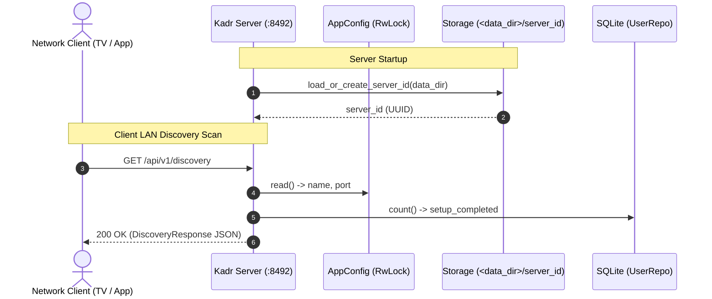

# Server Name & Network Autodiscovery API Design Specification

## Overview
This specification details the server name configuration and unauthenticated network autodiscovery API endpoint (`GET /api/v1/discovery`) for Kadr. Clients (smart TVs, mobile apps, desktop players, and browsers) scanning the local network for open Kadr ports (default `8492`) can query this endpoint without credentials to discover the server identity, display name, version, and setup status.

---

## 1. Requirements & User Intent
1. **Server Name Configuration**:
   - Stored in `kadr.toml` under `[server] name = "..."`, defaulting to `"Kadr Media Server"`.
   - Modifiable dynamically via the Web Admin Dashboard (`PUT /api/v1/system/config`).
2. **Persistent Server Identity (`server_id`)**:
   - Unique UUID generated on first startup and persisted in `<data_dir>/server_id`.
   - Preserves client pairing and identity across server IP address changes and renames.
3. **Autodiscovery API Endpoint (`GET /api/v1/discovery`)**:
   - Public, unauthenticated endpoint reachable over LAN/WAN with IP rate limiting.
   - Returns machine-readable server metadata: `app`, `server_id`, `name`, `version`, `protocol_version`, `port`, `setup_completed`, and `status`.
4. **Web Admin Dashboard Integration**:
   - Adds "Server Name" editing to the Server Configuration section in `AdminDashboard.tsx`.
   - Updates `client.ts` with `getDiscoveryInfo()` and extended `SystemConfig` interfaces.

---

## 2. Architecture & Data Flow



---

## 3. Backend Interfaces & Specification

### 3.1 Configuration & Server Settings (`crates/kadr-server/src/config.rs`)
```rust
#[derive(Debug, Clone, Serialize, Deserialize)]
pub struct ServerSettings {
    #[serde(default = "default_server_name")]
    pub name: String,
    #[serde(default = "default_host")]
    pub host: String,
    #[serde(default = "default_port")]
    pub port: u16,
    #[serde(default = "default_data_dir")]
    pub data_dir: PathBuf,
    #[serde(default)]
    pub web_dir: Option<PathBuf>,
}

fn default_server_name() -> String {
    "Kadr Media Server".to_string()
}
```

### 3.2 Persistent Server Identity (`ServerIdentity`)
* Helper in `crates/kadr-server/src/identity.rs` or `config.rs`:
```rust
#[derive(Debug, Clone)]
pub struct ServerIdentity {
    pub id: String,
}

pub fn load_or_create_server_id(data_dir: &Path) -> Result<String, std::io::Error> {
    let id_file = data_dir.join("server_id");
    if id_file.is_file() {
        if let Ok(content) = std::fs::read_to_string(&id_file) {
            let trimmed = content.trim();
            if !trimmed.is_empty() {
                return Ok(trimmed.to_string());
            }
        }
    }
    std::fs::create_dir_all(data_dir)?;
    let new_id = uuid::Uuid::new_v4().to_string();
    std::fs::write(&id_file, &new_id)?;
    Ok(new_id)
}
```
* Injected into the Axum router via `.layer(Extension(Arc::new(ServerIdentity { id })))`.

### 3.3 Discovery Route (`crates/kadr-server/src/api/discovery_routes.rs`)
```rust
#[derive(Debug, Clone, Serialize, Deserialize, PartialEq, Eq)]
pub struct DiscoveryResponse {
    pub app: String,               // "kadr"
    pub server_id: String,         // persistent UUID
    pub name: String,              // configured server name
    pub version: String,           // env!("CARGO_PKG_VERSION")
    pub protocol_version: u32,     // 1
    pub port: u16,                 // configured port
    pub setup_completed: bool,     // user_repo.count().await.unwrap_or(0) > 0
    pub status: String,            // "online"
}

pub async fn get_discovery(
    Extension(identity): Extension<Arc<ServerIdentity>>,
    Extension(config): Extension<Arc<tokio::sync::RwLock<AppConfig>>>,
    Extension(user_repo): Extension<UserRepository>,
) -> (StatusCode, Json<DiscoveryResponse>) {
    let cfg = config.read().await;
    let setup_completed = user_repo.count().await.unwrap_or(0) > 0;

    let response = DiscoveryResponse {
        app: "kadr".to_string(),
        server_id: identity.id.clone(),
        name: cfg.server.name.clone(),
        version: env!("CARGO_PKG_VERSION").to_string(),
        protocol_version: 1,
        port: cfg.server.port,
        setup_completed,
        status: "online".to_string(),
    };

    (StatusCode::OK, Json(response))
}
```
* Registered in `crates/kadr-server/src/api/mod.rs`:
  ```rust
  .route("/api/v1/discovery", get(discovery_routes::get_discovery))
  ```

### 3.4 Admin Configuration Endpoints (`crates/kadr-server/src/api/config_routes.rs`)
```rust
#[derive(Debug, Clone, Serialize, Deserialize)]
pub struct SystemConfigResponse {
    pub name: String,
    pub host: String,
    pub port: u16,
    pub data_dir: String,
    pub web_dir: Option<String>,
    pub database_path: String,
    pub max_readers: usize,
    pub debounce_millis: u64,
    pub use_ffprobe: bool,
}

#[derive(Debug, Clone, Deserialize)]
pub struct UpdateConfigPayload {
    pub name: Option<String>,
    pub host: Option<String>,
    pub port: Option<u16>,
    pub debounce_millis: Option<u64>,
    pub use_ffprobe: Option<bool>,
}
```
* In `update_config`:
  ```rust
  if let Some(name) = payload.name {
      let trimmed = name.trim();
      if !trimmed.is_empty() {
          cfg.server.name = trimmed.to_string();
      }
  }
  ```

---

## 4. Frontend Specifications (`web/`)

### 4.1 TypeScript Types (`web/src/types/index.ts`)
```typescript
export interface DiscoveryResponse {
  app: 'kadr';
  server_id: string;
  name: string;
  version: string;
  protocol_version: number;
  port: number;
  setup_completed: boolean;
  status: 'online';
}

export interface SystemConfig {
  name: string;
  host: string;
  port: number;
  data_dir: string;
  web_dir?: string;
  database_path: string;
  max_readers: number;
  debounce_millis: number;
  use_ffprobe: bool;
}

export interface UpdateConfigPayload {
  name?: string;
  host?: string;
  port?: number;
  debounce_millis?: number;
  use_ffprobe?: bool;
}
```

### 4.2 Web Client (`web/src/api/client.ts`)
```typescript
public async getDiscoveryInfo(): Promise<DiscoveryResponse> {
  return this.request<DiscoveryResponse>('/api/v1/discovery');
}
```

### 4.3 Admin Dashboard UI (`web/src/components/admin/AdminDashboard.tsx`)
* State: `const [editName, setEditName] = useState('Kadr Media Server');`
* In `loadData`: `if (cfg.name) setEditName(cfg.name);`
* Under "Server Configuration":
  ```tsx
  <div>
    <label className="block text-xs font-semibold text-muted uppercase tracking-wider mb-2">
      Server Name
    </label>
    <input
      type="text"
      value={editName}
      onChange={(e) => setEditName(e.target.value)}
      placeholder="e.g. Living Room Kadr"
      className="w-full bg-canvas border border-border-subtle rounded-lg px-3 py-2 text-text-main text-sm focus-visible:ring-3 focus-visible:ring-highlight focus-visible:outline-none"
    />
  </div>
  ```
* On save:
  ```tsx
  await api.updateSystemConfig({
    name: editName.trim() || undefined,
    host: editHost.trim() || undefined,
    port: editPort,
    debounce_millis: editDebounce,
    use_ffprobe: editFfprobe,
  });
  ```

---

## 5. Security & Error Handling
* **Public Discovery Exposure**: The endpoint exposes non-sensitive operational information (`name`, `version`, `port`, `setup_completed`). Sensitive storage paths, database paths, and secrets are strictly excluded.
* **Rate Limiting**: Axum IP rate limiter guards the endpoint to prevent flooding.
* **Fallback Defaults**:
  - Missing server name defaults to `"Kadr Media Server"`.
  - Missing or unreadable `server_id` file generates a fresh UUID.

---

## 6. Verification & Test Plan
1. **Unit & Integration Tests (`crates/kadr-server/tests/discovery_test.rs`)**:
   - `test_load_or_create_server_id`: File creation and idempotent reload.
   - `test_get_discovery_endpoint`: Verifies 200 OK, JSON schema, matching server ID, app name `"kadr"`, version, and `setup_completed`.
   - `test_update_server_name_reflected_in_discovery`: Verifies admin config update changes `name` in discovery response.
2. **Frontend Component Tests (`web/src/components/admin/AdminDashboard.test.tsx`)**:
   - Verifies server name input displays current name.
   - Verifies saving config passes updated `name`.
3. **Workspace Quality Gates**:
   - `cargo test --workspace` (100% pass)
   - `cargo clippy --workspace --all-targets -- -D warnings` (0 warnings)
   - `cd web && npm test -- --run` (100% pass)
   - `npm run build` (0 errors)
