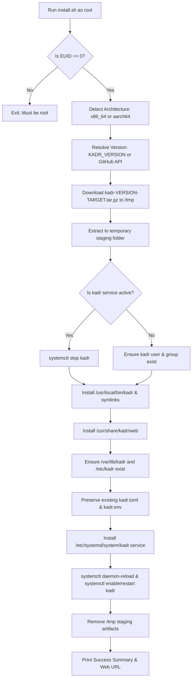

# Design Specification: Linux Install Script & Upgrade Documentation

**Date:** 2026-10-07  
**Topic:** Universal Linux Install Script & Upgrade Documentation  
**Status:** Approved  

---

## 1. Overview & Goals

1. **Universal Linux Online Installer**: Provide a single, robust, interactive/unattended bash installer script (`scripts/install.sh` and root symlink `install.sh`) that can be fetched via `curl | sudo bash` on any Linux distribution (Fedora, Arch, openSUSE, Alpine, RHEL, CentOS, Debian, etc.).
2. **Seamless Upgrade Support**: The script must detect whether Kadr is already installed. If installed, it performs an in-place upgrade (stops service, swaps binary and web assets, preserves database and configs, restarts service).
3. **Offline Tarball Installer Polish**: Enhance `packaging/scripts/install.sh` (bundled inside `.tar.gz` releases) to cleanly support upgrades and non-systemd init environments.
4. **Comprehensive Upgrade Guide in `README.md`**: Provide step-by-step instructions for upgrading via `.deb`, online installer, and manual tarball, with clear data safety guarantees.

---

## 2. Universal Linux Online Installer (`scripts/install.sh`)

### 2.1 Workflow


### 2.2 Detailed Behavior
- **Root Check**: Verify running with `EUID -eq 0`, otherwise abort with user-friendly error message.
- **Architecture Detection**:
  - `x86_64` / `amd64` $\to$ `x86_64-unknown-linux-musl`
  - `aarch64` / `arm64` $\to$ `aarch64-unknown-linux-musl`
  - Other architectures $\to$ error out with supported architectures list.
- **Version Resolution**:
  - If `KADR_VERSION` environment variable is specified, use that tag.
  - Otherwise, query GitHub API:
    `curl -sSf https://api.github.com/repos/BooDy/kadr/releases/latest | grep '"tag_name":' | head -n1`
    (with graceful fallback to current stable tag `v0.1.1-alpha` if rate limited or unauthenticated).
- **Download & Verification**:
  - Downloads `.tar.gz` archive to `/tmp/kadr-install-XXXXXX/`.
  - Verifies extraction succeeded.
- **Service Management**:
  - Checks if `systemctl is-active --quiet kadr`. If active, records `WAS_ACTIVE=true` and runs `systemctl stop kadr`.
- **File Deployment**:
  - Binary installed to `/usr/local/bin/kadr` (`chmod 0755`), with symlink `/usr/bin/kadr`.
  - Web client assets copied to `/usr/share/kadr/web/` (`chmod -R a+rX`).
- **Data & Configuration Preservation**:
  - `/var/lib/kadr` created with `0750` permissions owned by `kadr:kadr`.
  - If `/etc/kadr/kadr.toml` or `kadr.env` already exist, they are **never overwritten**.
  - If not present, default templates from the release bundle are copied into `/etc/kadr/`.
- **Systemd Setup**:
  - Installs `/etc/systemd/system/kadr.service` if systemd directory exists.
  - Runs `systemctl daemon-reload`.
  - If `WAS_ACTIVE=true`, runs `systemctl restart kadr`.
  - If fresh installation, runs `systemctl enable --now kadr`.
  - If not systemd (e.g. Alpine/OpenRC), prints sample command to launch kadr directly or with local init.

---

## 3. Bundled Tarball Installer Polish (`packaging/scripts/install.sh`)

Update the offline script executed when extracting standalone archives:
- Stop active `kadr.service` before overwriting `/usr/local/bin/kadr` (prevents "text file busy" errors on Linux).
- Restart `kadr.service` if it was previously active.
- Explicitly protect existing configuration in `/etc/kadr/`.
- Handle non-systemd environments cleanly without fatal exit when `systemctl` is unavailable.

---

## 4. Documentation & Upgrade Guide (`README.md`)

Add a dedicated **"Upgrading Kadr"** section in `README.md`:

### Structure:
1. **Automated Upgrade (All Linux Distributions)**:
   ```bash
   curl -fsSL https://raw.githubusercontent.com/BooDy/kadr/main/scripts/install.sh | sudo bash
   ```
2. **Debian / Ubuntu / Raspberry Pi OS Package (`.deb`)**:
   ```bash
   sudo dpkg -i kadr_<version>_<arch>.deb
   sudo systemctl restart kadr
   ```
3. **Manual Tarball Upgrade**:
   ```bash
   tar -xzf kadr-<version>-<arch>-unknown-linux-musl.tar.gz
   cd kadr-<version>-<arch>-unknown-linux-musl
   sudo ./install.sh
   ```
4. **Data Safety Assurance**:
   - Explicit confirmation that SQLite database schema migrations run automatically on startup.
   - All library configurations, user accounts, and playback positions in `/var/lib/kadr/kadr.db` remain untouched.
   - Upgrade rollback notes.

---

## 5. Verification Plan

1. **Script Validation**:
   - Run `shellcheck` (or bash `-n` syntax check) on `scripts/install.sh` and `packaging/scripts/install.sh`.
   - Test `scripts/install.sh --dry-run` or with mock targets to verify argument parsing, architecture resolution, and error handling.
   - Test execution of `packaging/scripts/install.sh` in a controlled test environment.
2. **README Accuracy**:
   - Verify all URLs, package names, and commands in `README.md` are exact and match release artifacts.
